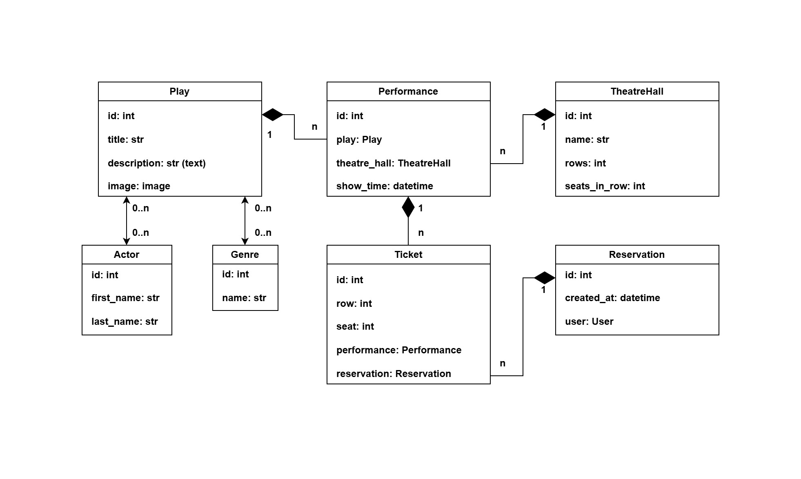
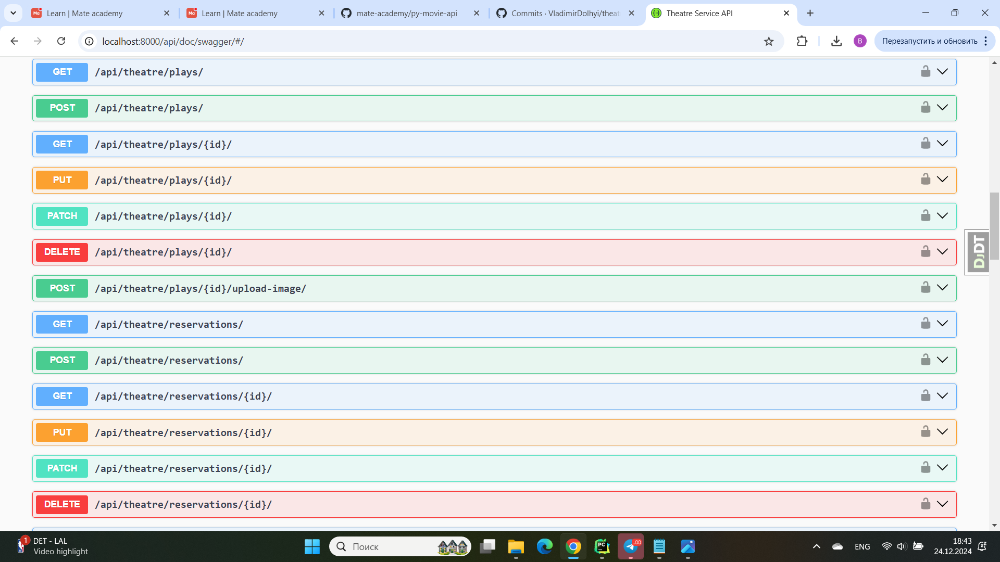
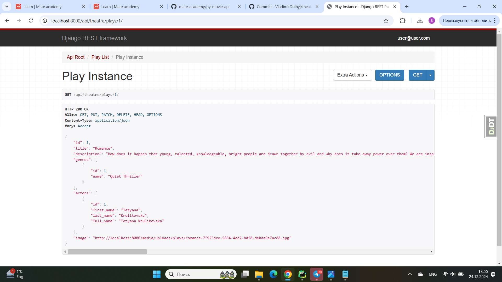
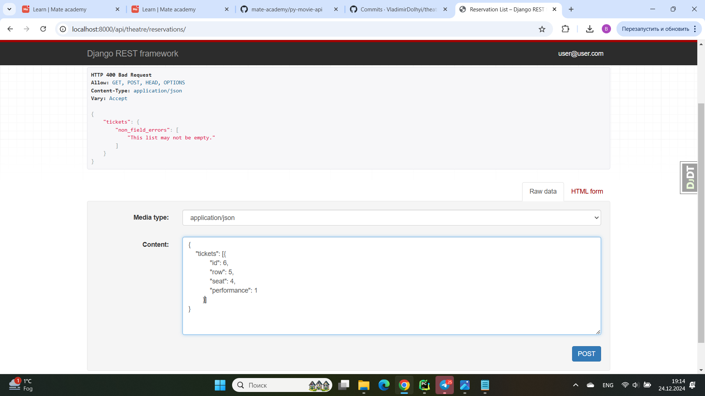
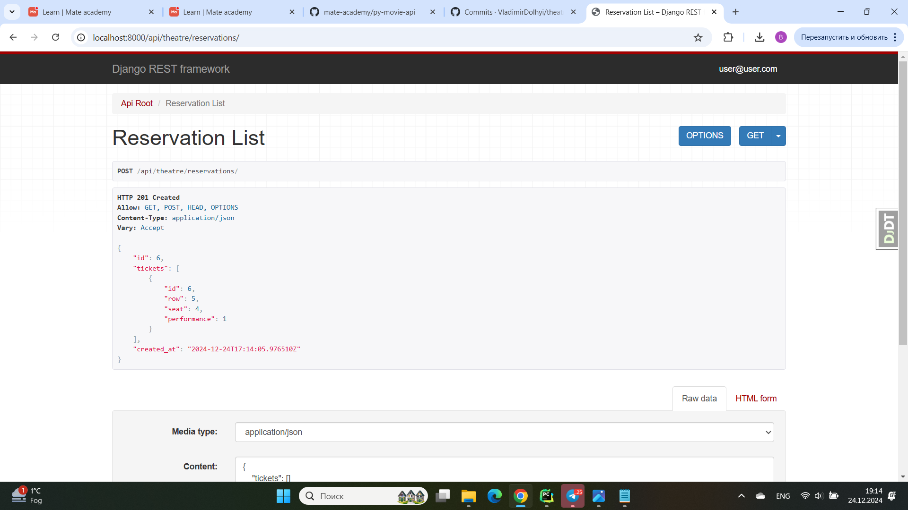

# Theatre API

### 👉 Description

API service for theatre management written on DRF

### 👉 Installing using GitHub

Python3 must be already installed  
Install PostgresSQL and create db

### ✨ How to use it

> Download the code 

```bash
$ # Get the code
$ git clone https://github.com/VladimirDolhyi/theatre-api.git
$ cd theatre_api
```

#### 👉 Set Up

> Install modules via `VENV`  

```bash
$ python -m venv venv
$ source venv/bin/activate (on macOS)
$ venv\Scripts\activate (on Windows)
$ pip install -r requirements.txt
```

> Set Up Database

```bash
$ set DB_HOST=<your db hostname>
$ set DB_NAME=<your db name>
$ set DB_USER=<your db username>
$ set DB_PASSWORD=<your db user password>
$ set SECRET_KEY=<your secret key>

$ python manage.py migrate
```
> Run the server

```bash
$ python manage.py runserver
```

### 👉 Run with docker

Docker should be installed

```bash
docker-compose build
docker-compose up
```

### 👉 Getting access

* create user via /api/user/register
* get access token via /api/user/token

### 👉 Features

* JWT authenticated
* Admin panel /admin/
* Documentation is located at /api/doc/swagger/
* Managing orders and tickets
* Creating plays with genres, actors
* Creating theatre halls
* Adding performances
* Filtering plays and performances


### 👉 Database Schema


### 👉 Endpoints Example


### 👉 Play Page


### 👉 Create Reservation


### 👉 New Reservation

